# AI Pixel-Snapped Game Sprites — Real Pixels From AI, Game-Ready

Prompt templates, reference images, and the actual game-ready spritesheets for two characters (pirate and skeleton) — generated entirely with AI, snapped to real pixel art, and dropped straight into a game.

| Pirate (combined: walk · attack · hurt · death) |
|:---:|
| 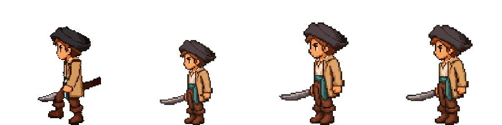 |

*Every frame above is AI-generated, snapped to a discoverable native grid, normalised to a 256×256 runtime cell with a locked foot baseline. No mixels, no bleeding between frames, no drift.*

📺 **Watch the full tutorial:** [Stop Generating Fake Pixel Art Game Sprites - Full Guide](https://www.youtube.com/watch?v=nIAIxvNUrdU)

🧩 **Excalidraw Cheatsheet:** [Pixel-Snap Pipeline Cheatsheet](https://aiod.dev/vgd-06-cheatsheet?utm_source=github&utm_medium=readme_top&utm_campaign=vgd-06)

🐦 **Follow [@chongdashu](https://x.com/chongdashu) on X** for daily AI gamedev tips, prompts, and experiments.

This repo contains everything you need to follow along:

- `prompts/` — the exact prompt templates, one per pipeline step (eight in total)
- `references/` — the reference images you'll see at each pipeline stage (problems, prompt-discipline comparisons, anchors, pose boards, runtime spritesheets, diagrams)
- `references/grids/` — the actual alternating-pixel guide canvases referenced by prompts 03 and 04 (1024×1024 anchor guide, 2048×1536 hires pose-board guide)
- `spritesheets/` — the final, game-ready output for both characters: pirate and skeleton, six animations each (idle, walk, attack, hurt, jump, death)

---

## Want more like this?

- [**Free Insiders**](https://insiders.aioriented.dev?utm_source=github&utm_medium=readme_more_like_this&utm_campaign=vgd-06) — newsletter + cheat sheets, prompts, and reference images from every video.
- [**VibeGameDev**](https://vibegamedev.com?utm_source=github&utm_medium=readme_more_like_this&utm_campaign=vgd-06) — agent skills that automate this whole pipeline (`gamedev-assets`, `animated-spritesheets`, `pixel-snapper`), full source from every project, and the step-by-step tutorial for the survival beat-em-up these sprites drop into.

---

## The 3 Problems This Pipeline Fixes

If you've tried to use AI to generate game sprites, you've probably hit these:

| Problem | What it looks like |
|---|---|
| **1. Mixels — fake pixel art that breaks when you zoom in** | 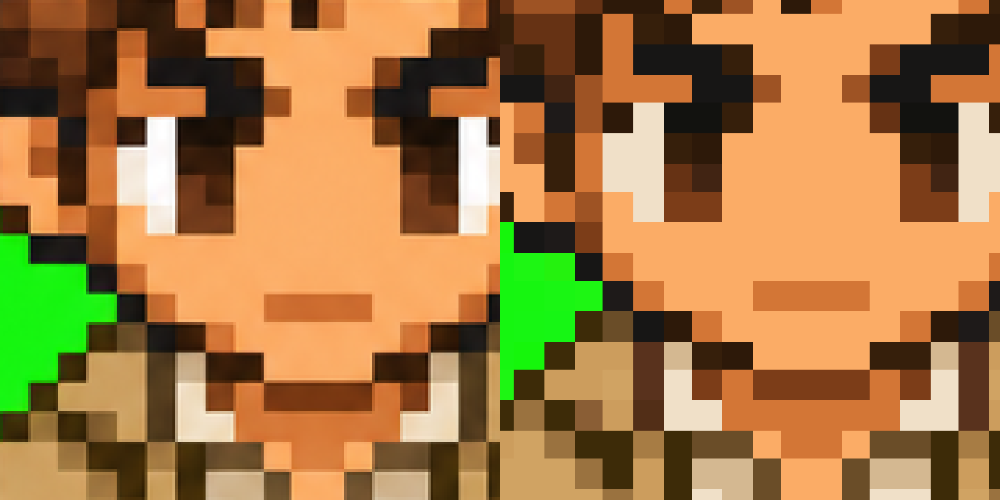 |
| **2. Frame bleeding — naive grid crops chop your sprites** | 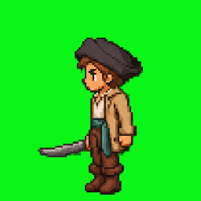 |
| **3. Frame drift — sliding, bobbing, jankiness in-game** | 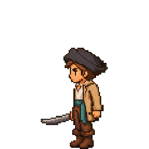 |

This pipeline fixes all three.

---

## The Pipeline

> Image gen ≈ 20% of the work. The other 80% is the post-processing pipeline below.

```text
text prompt + style guide
  → south anchor (1024×1024 chroma green)
  → pixel snap (recover native grid, NN upscale, re-key chroma)
  → directional anchors NSEW (snapped chroma S as identity)
  → pixel snap each direction → canonical reference per direction
  → action pose boards (snapped chroma anchor + pose-board guide)
  → frame recovery (foreground components, NOT grid crops)
  → native review checkpoint (foot-aligned, no scaling)
  → per-frame chroma-layout snap
  → background clean + green-fringe despeckle
  → normalise to 1280×512 runtime sheet (5×2 cells of 256×256, foot-anchored)
  → frame aligner (manual 1-2 pixel polish)
  → game-ready spritesheet
```

Walk cycles take a parallel input path (image-to-video instead of still-image), and converge into the same downstream pipeline after frame selection.

| Stage | Output |
|---|---|
| Bad prompt (detail-heavy) ❌ | 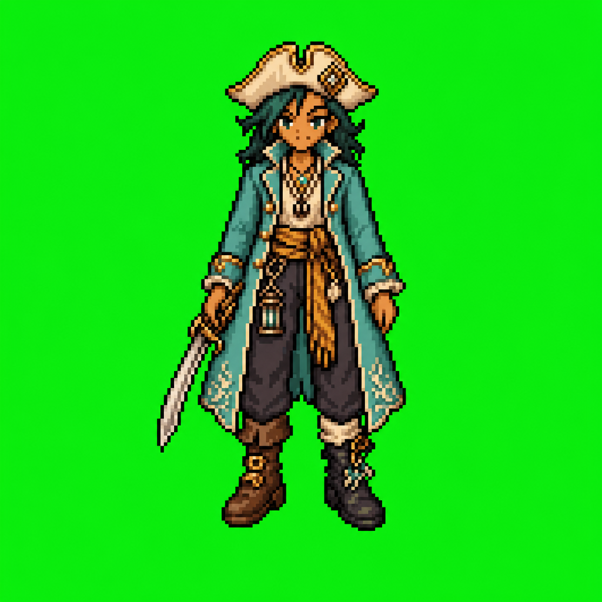 |
| Bad prompt — recovered native (174×177) ❌ | 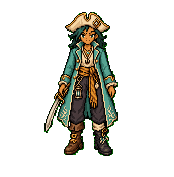 |
| Good prompt (restrictive) ✅ | 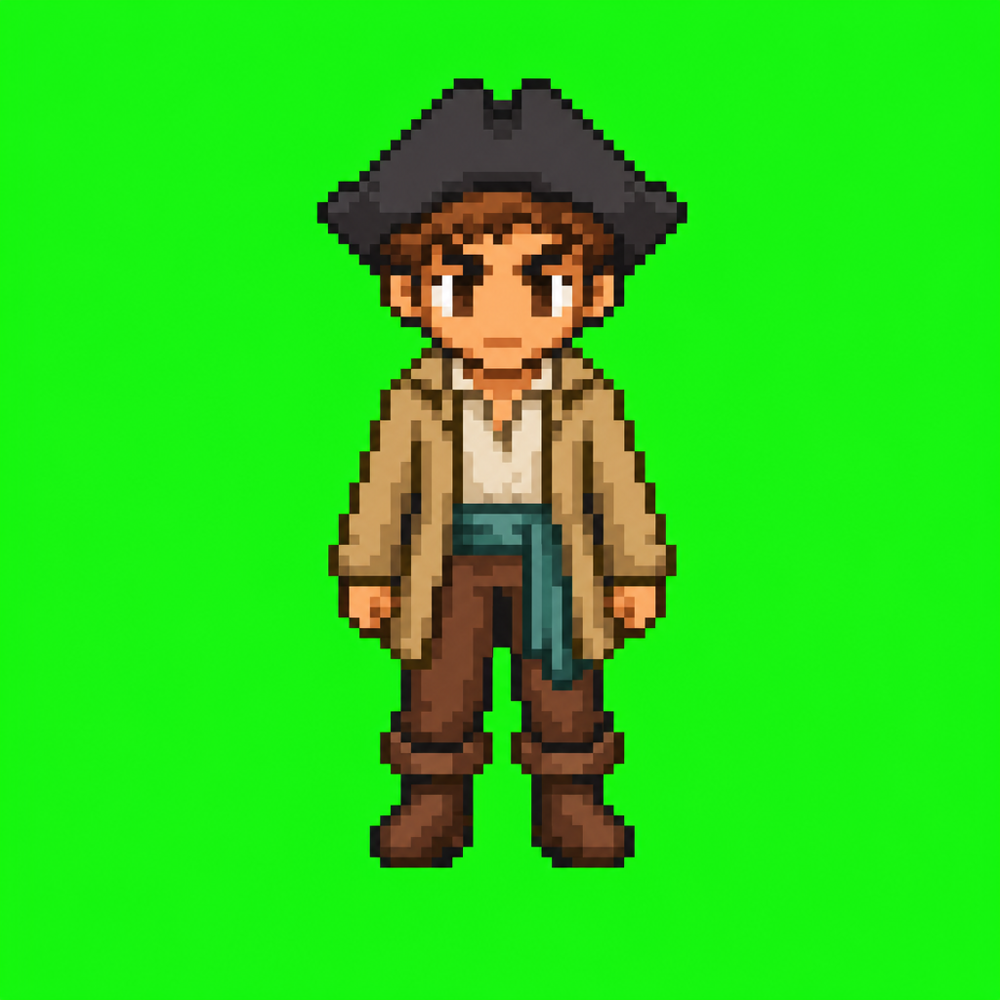 |
| Good prompt — recovered native (96×96) ✅ | 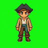 |
| NSEW directional anchors | 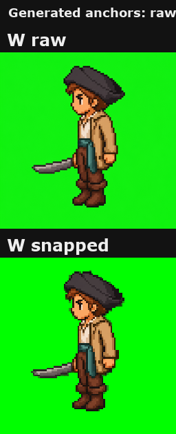 |
| Generated pose board (attack, hires preset) | 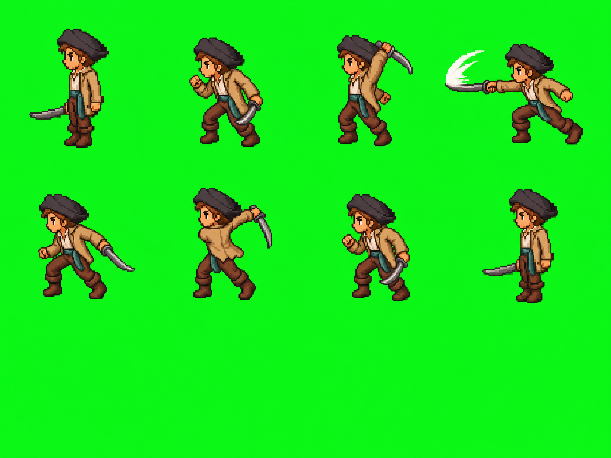 |
| Naive grid vs recovered components | 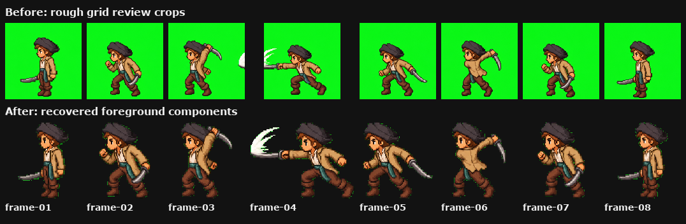 |
| Native review checkpoint | 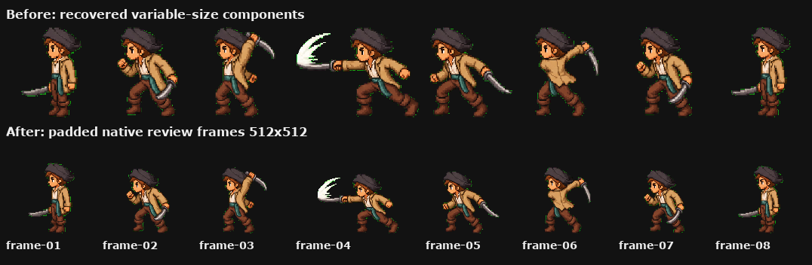 |
| Per-frame snapped (strike frame) | 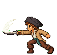 |
| Final runtime spritesheet (1280×512) | 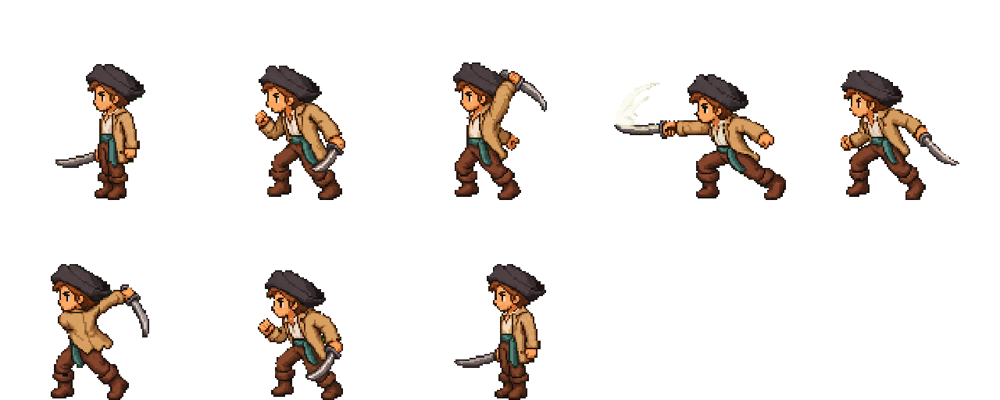 |
| Final runtime preview | 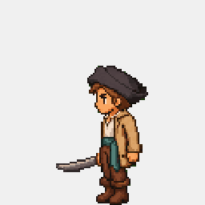 |

---

## Prompt Templates

Step-by-step templates with `{PLACEHOLDERS}` you fill in for your own character:

1. [01 — South Anchor](prompts/01-south-anchor.md) — the most important image you'll generate
2. [02 — Pixel Snap](prompts/02-pixel-snap.md) — recover the native grid, NN upscale, re-key chroma
3. [03 — Directional Anchors](prompts/03-directional-anchors.md) — NSEW from the snapped south
4. [04 — Action Spritesheet](prompts/04-action-spritesheet.md) — pose boards for idle/attack/hurt/jump/death
5. [05 — Frame Recovery](prompts/05-frame-recovery.md) — foreground components, NOT grid crops
6. [06 — Walk Cycle (image-to-video)](prompts/06-walk-cycle-i2v.md) — the only thing that actually works
7. [07 — Per-Frame Chroma-Layout Snap](prompts/07-per-frame-snap.md) — stops mixel re-emergence at runtime
8. [08 — Runtime Normalise + Frame Aligner](prompts/08-runtime-normalize-and-align.md) — pack, foot-anchor, polish

---

## The Stack

- **Image generation:** GPT Image 2.0 (anchors, idle, attack, hurt, jump, death)
- **Walk cycles:** [fal.ai](https://fal.ai) → WAN 2.0 / SeedDance 2.0 (image-to-video)
- **Pixel snap:** Port of the open-source [Sprite Fusion Pixel Snapper](https://github.com/Hugo-Dz/spritefusion-pixel-snapper) — credit to the Sprite Fusion team
- **Background removal:** Bria via fal, or remove.bg
- **Skills (optional, automated pipeline):** `gamedev-assets` + `animated-spritesheets` + `pixel-snapper` ([VibeGameDev](https://vibegamedev.com?utm_source=github&utm_medium=readme_body_stack&utm_campaign=vgd-06))

---

## Game-Ready Spritesheets (Pirate + Skeleton)

Two characters, six animations each, all generated through the pipeline above. Drop into any 2D engine.

| | Idle | Walk | Attack | Hurt | Jump | Death |
|---|:---:|:---:|:---:|:---:|:---:|:---:|
| **Pirate** | 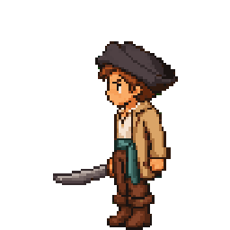 | 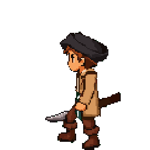 |  | 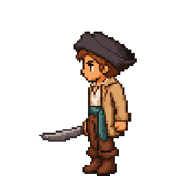 |  | 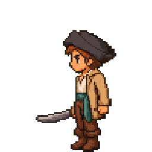 |
| **Skeleton** | 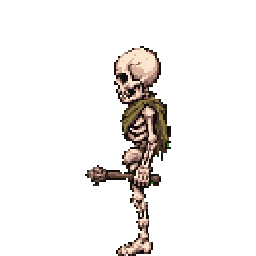 |  |  | 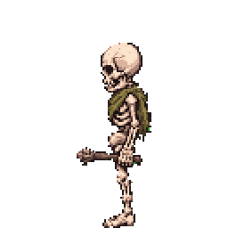 |  |  |

Each animation directory contains:

- `spritesheet.png` — the runtime sheet (1280×512 RGBA, 5×2 cells of 256×256)
- `preview.gif` — animated preview at the manifest fps
- `manifest.json` — frame count, columns, rows, fps, anchor

The `manifest.json` anchor `(128, 255)` is foot-anchored: horizontal centre, bottom of cell. Every frame in every sheet, every animation, every character shares this baseline — that's why the figure doesn't drift in-game.

---

## What You'll Learn

- Why most AI-generated "pixel art" isn't real pixel art (mixels vs real pixels)
- The 3 problems that break AI sprites in a real game: **mixels, frame bleeding, frame drift**
- The upstream prompt discipline that determines whether pixel snap can work (96×96 vs 174×177 native grid recovery)
- Why you should pass the *snapped* anchor — not the raw 1024 — into every downstream generation
- Frame recovery: extracting characters via chroma-key bounding boxes instead of naive grid crops
- The native review checkpoint that catches bad recoveries before runtime normalisation
- Per-frame chroma-layout snap that stops mixel re-emergence in animation frames
- Runtime normalise: 1280×512 sheet, 5×2 cells, foot-baseline lock
- Manual frame alignment: when to do the 1-2 pixel polish, when to skip it
- The two-part rule: prompt discipline upstream, snap pipeline downstream

> Walk cycles need a different (image-to-video) approach. File 06 covers it.

---

## License

MIT — see [LICENSE](LICENSE). Use these prompts, references, and spritesheets freely in your own projects.

If this helped you:

- ⭐ Star this repo
- 🐦 Follow [@chongdashu](https://x.com/chongdashu) on X for more AI gamedev
- 📺 Subscribe on [YouTube @AIOriented](https://www.youtube.com/@AIOriented)
- 🎮 Check out [VibeGameDev](https://vibegamedev.com?utm_source=github&utm_medium=readme_footer&utm_campaign=vgd-06) for the full automation toolkit
