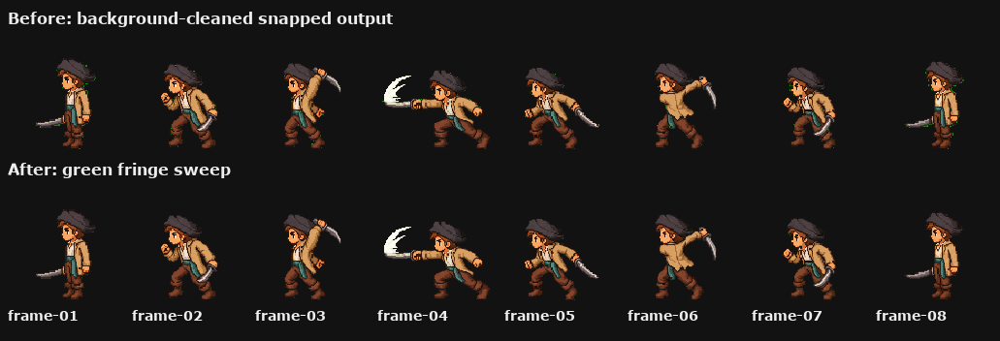

# 08 — Runtime Normalise + Frame Aligner (the polish layer)

The last pipeline stage. Three deterministic substeps + one optional manual polish.

## 8a — Background clean + green-fringe despeckle

Run per-frame background removal and a despeckle pass on the snapped output. **Per-frame, not whole-sheet** — bleed between cells confuses edge detection.

| Approach | When |
|---|---|
| Simple Python script (chroma-key + alpha) | Pixel-snapped frames, locked palette |
| AI bg-removal (Bria via fal, remove.bg) | Frames where chroma key alone leaves edge fringe |

Then a despeckle pass catches stray chroma pixels at hard edges.



## 8b — Normalise to runtime sheet (1280×512, 5×2 cells)

Pack the snapped, alpha-clean frames into a final runtime spritesheet:

| Spec | Value |
|---|---|
| Sheet | 1280×512 RGBA |
| Cells | 5 columns × 2 rows |
| Cell size | 256×256 |
| Anchor | `(128, 255)` — horizontal centre, bottom of cell |

The 256×256 cell size keeps the texture atlas small enough for memory-friendly games while leaving headroom for taller frames (jump apex, death recoil).

### Foot-baseline lock (this is the bit most pipelines skip)

For each frame:

1. Find the bottom-most non-transparent row.
2. Place that row on **y = 255** in the cell.
3. Centre the frame horizontally on **x = 128**.

This makes the foot baseline consistent across every frame. Without it, taller frames sit higher (the character bobs vertically while it animates).

| Runtime spritesheet | Preview |
|---|---|
|  |  |

## 8c — Frame alignment (the optional manual polish)

Even after snap + foot-baseline normalise, frames sometimes drift by 1–2 pixels. The character bobs slightly. Most pipelines ship with that. The fix:

- Open the runtime sheet in a viewer that shows a **foot-baseline overlay across all frames**.
- Spot a drifting frame, **nudge it 1–2 pixels** with arrow keys.
- Preview the loop.
- Export.

A simple HTML/Canvas tool with onion-skinning between frames is usually enough. AI can do this too (with a prompt like *"align these frames so the eyes sit on the same row"*) but for 8 frames it's faster to do it manually.

## 8d — Manifest

Save a small JSON next to the sheet so the runtime can load it without parsing:

```json
{
  "version": 1,
  "action": "attack",
  "direction": "w",
  "spritesheet": "spritesheet.png",
  "previewGif": "preview.gif",
  "frameWidth": 256,
  "frameHeight": 256,
  "columns": 5,
  "rows": 2,
  "frames": 8,
  "fps": 10,
  "anchor": { "x": 128, "y": 255 }
}
```

The `spritesheets/` folder in this repo has one of these per action per character.

## What you ship

Per character per direction, six sheets:

- `idle/`, `walk/`, `attack/`, `hurt/`, `jump/`, `death/`

Each sheet is 1280×512, 5×2 cells of 256×256, foot-anchored, real pixel art. **Game-ready.** Drop into any 2D engine that loads spritesheets — Phaser, Godot, LÖVE, Unity 2D, custom WebGL.
